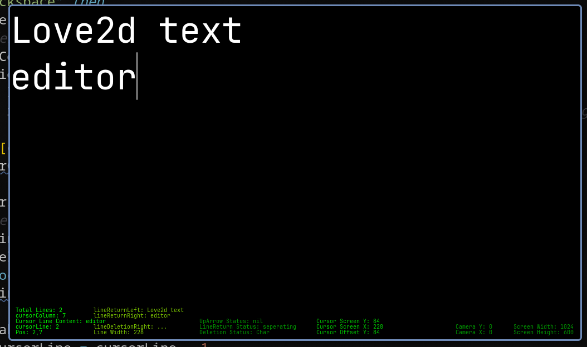

# Love2d Text Editor

a text editor made in a game engine 😭
The debugging overlay/hud is turned off, you can enable it in conf.lua by switching that false to true:
```lua
debugging = true
```

# why, signaa?
I made this so I could learn how to make text editor like features for a project i'm working on called SigmaCode

<!-- # To you
If you're making a text editor without web technologies, this could help you a lot trust me bro. Doesn't matter if you're using uhh C or some language that doesn't have some textarea built in for you. I suffered to make this without AI to learn but like.. do yourself a favor and consult mine yea -->

# Features:
 - Text rendering thanks to love2d
 - Basic text input (insert characters at cursor position)
 - Multiline text support
 - Cursor movement (left, right, up, down)
 - Cursor clamping per line (prevents out of bounds column positions)
 - Line creation by pressing Enter
 - Line splitting (Pressing Enter in middle of a line splits it into two lines)
 - Line merging (Backspace at start of line merges with previous line)
 - Character deletion (Backspace within a line)
 - Line deletion (Backspace on empty line / boundary case)
 - Horizontal camera scrolling based on cursor position
 - Vertical camera scrolling based on cursor position
 - Basic text editor viewport (camera transform system)
 - A caret! 🥕
 - Perline rendering system using indexed table
 - Debuging hud